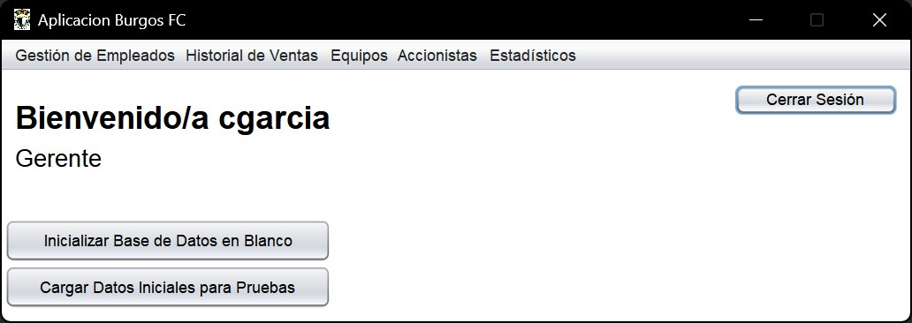
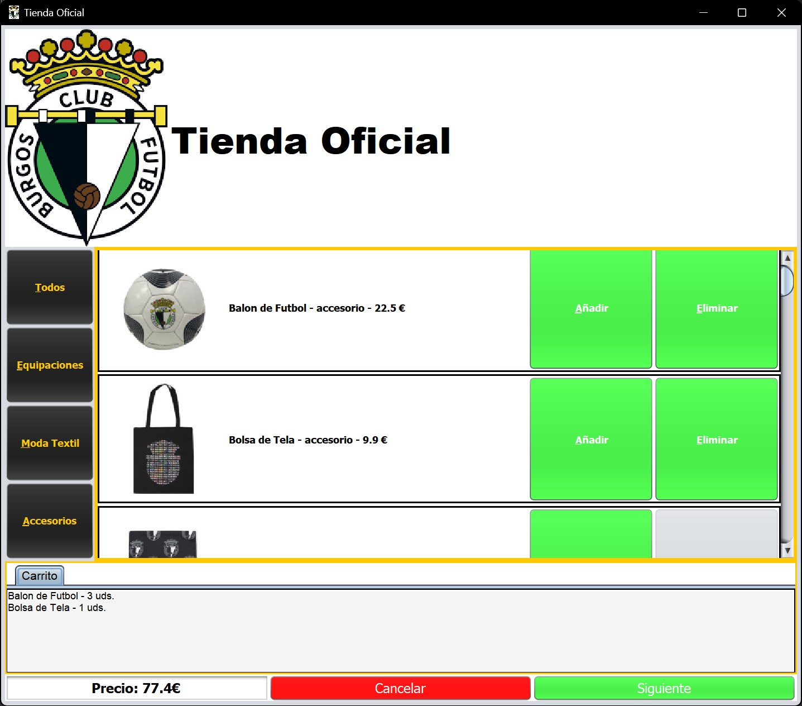
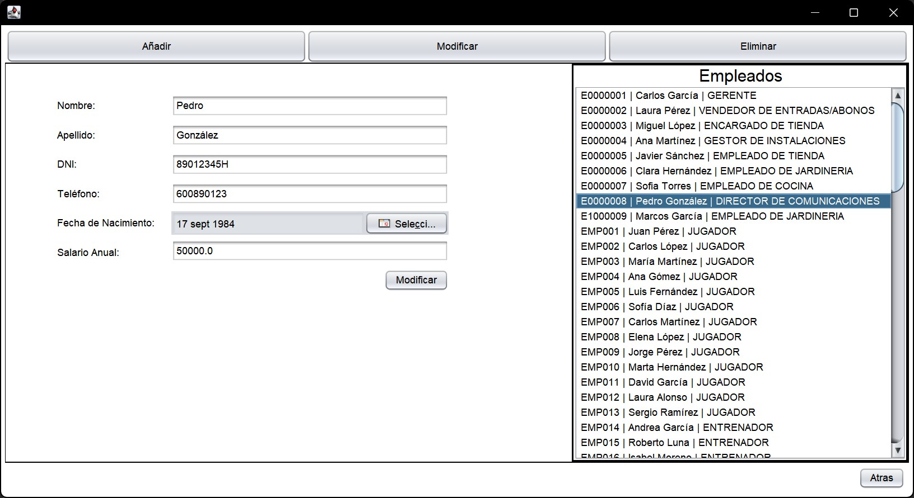
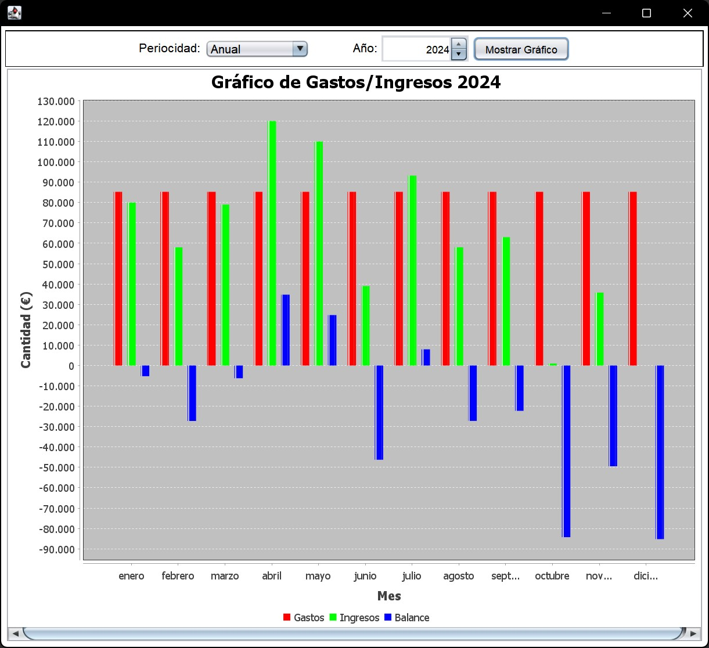
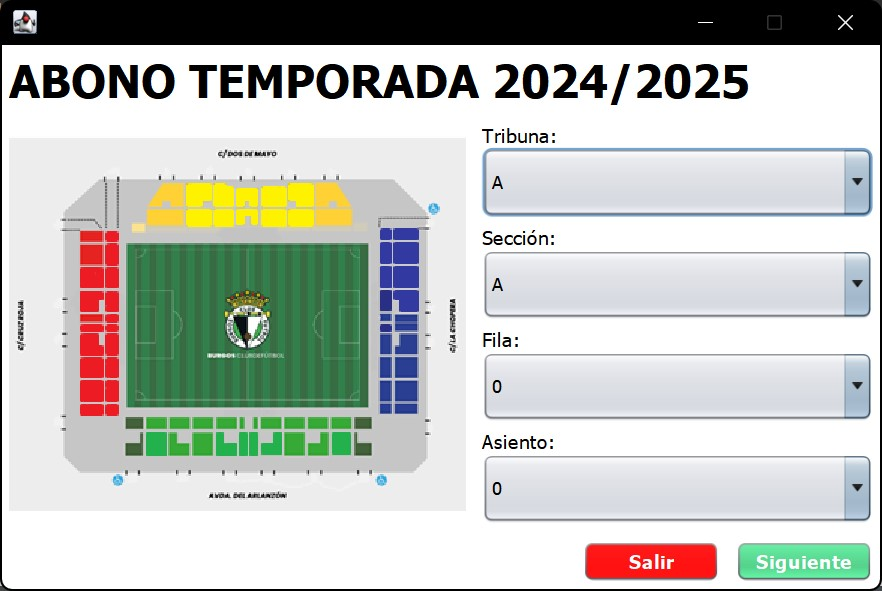
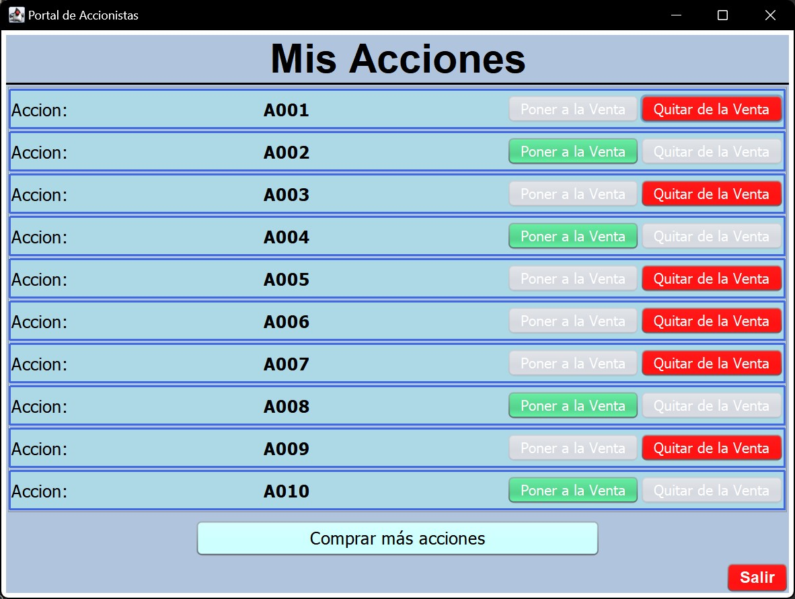

<h1 align="center">Aplicación de Gestión del Burgos CF</h1>

ℹ️ Repositorio para el desarrollo de un proyecto en Java para la asignatura "Ingeniería del Proceso Software"

## Contexto

Esta es una aplicación de gestión de un equipo de futbol, en este caso el Burgos CF.
La aplicación permite que se gestionen empleados (tanto jugadores como entrenadores o puestos más administrativos como el vendedor de entradas y abonos o los jardineros), gestionar partidos y entrenamientos, 
venta de entradas, merchandising y hasta acciones del club.

## Sistema de Usuarios

La aplicación dispone de un sistema de Log In que permite que aquellos usuarios registrados accedan a la aplicación con su rol correspondiente.
El rol del usuario en la aplicación condiciona las funcionalidades a las que este puede acceder dentro de la misma.

### Roles

Los roles de la aplicación son los siguientes:

- Jugador
- Entrenador
  - Añade horarios de entrenamiento a su equipo
  - Asigna franjas para posibles entrevistas a sus jugadores
- Gerente
  - Añade, modifica y elimina a empleados de la aplicación
  - Visualiza el historial de ventas del club
  - Añade equipos
  - Crea partidos
  - Crea y gestiona campañas de venta de acciones del club
  - Visualiza gráficos estadísticos que muestran la situación económica del club
- Vendedor de Entradas y Abonos
  - Vende entradas
  - Vende abonos
- Encargado de Tienda
  - Realiza compras de merchandising
- Gestor de Instalaciones
  - Gestiona la reserva de instalaciones deportivas a clientes ajenos al club
- Empleado de Tienda
  - Realiza compras de merchandising
- Empleado de Jardinería
- Empleado de Cocina
- Director de Comunicaciones
  - Crea entrevistas para los jugadores en sus franjas disponibles
  - Crea noticias para visualizar en el portal de noticias
- Accionista
  - Compra y vende acciones
- No Usuario (Entrar sin iniciar sesión)
  - Visualiza el portal de noticias
  - Accede a campañas de accionistas, convirtiendose en accionista en caso de comprar alguna acción

## Pantallas de la Aplicación

A continuación se muestran algunas partes de la interfaz de usuario de la aplicación

### Menú Inicial (Caso del Gerente)

### Compra de Merchandising

### Menú de Modificación de Empleados

### Gráfico Económico

### Compra de Abonos

### Portal de Accionistas

